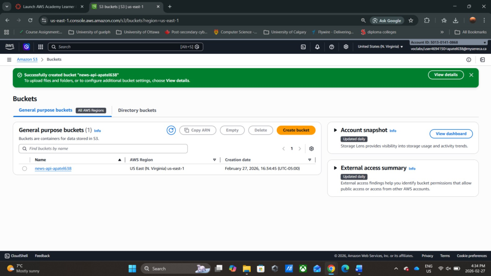
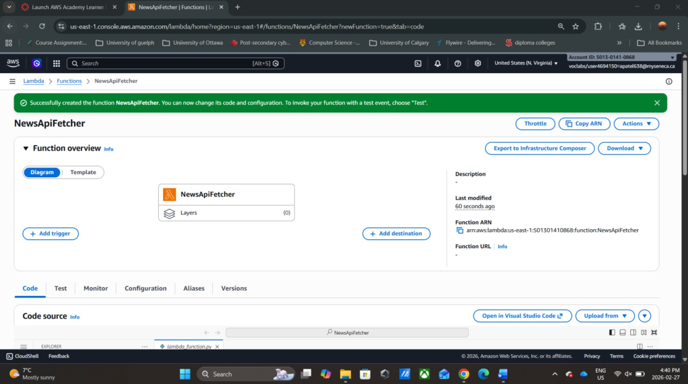
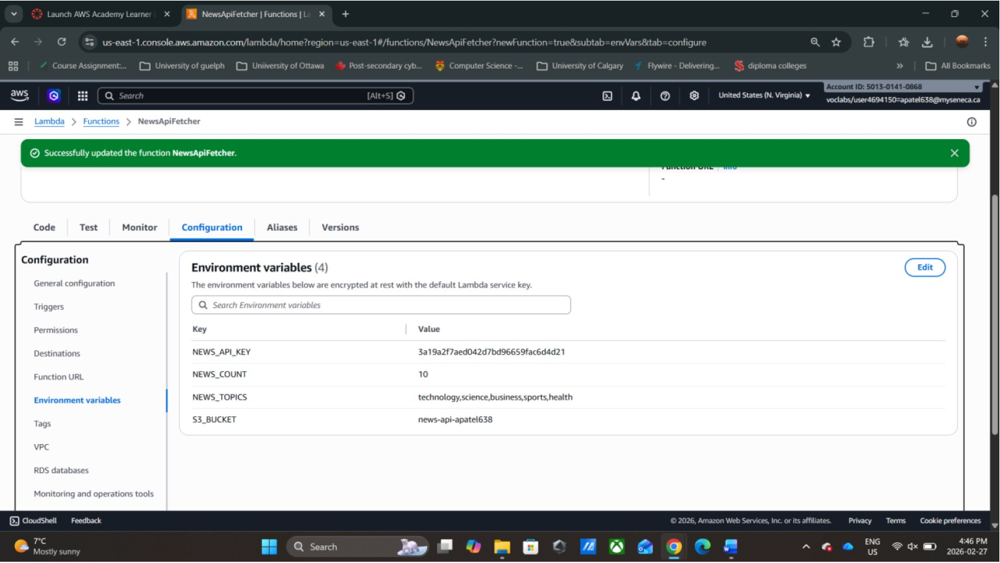
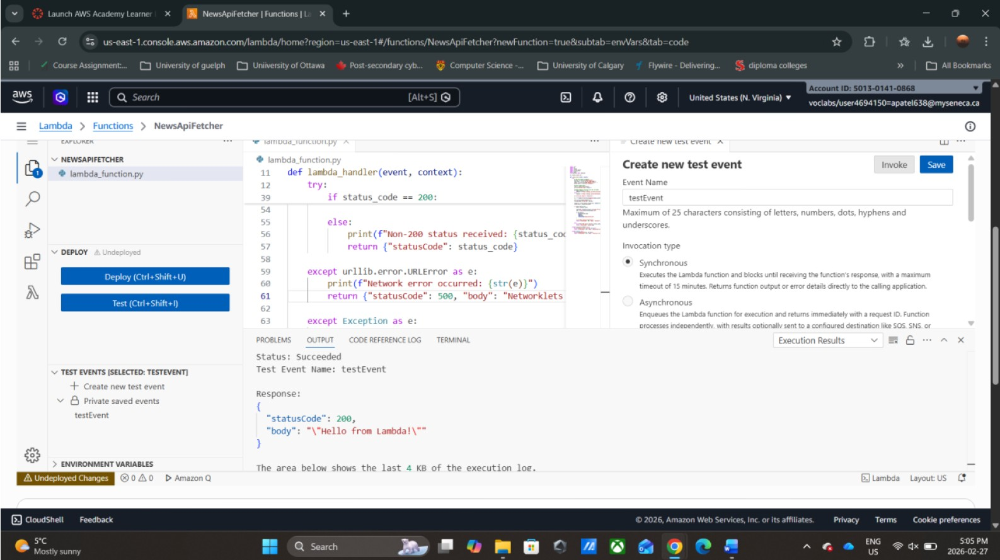
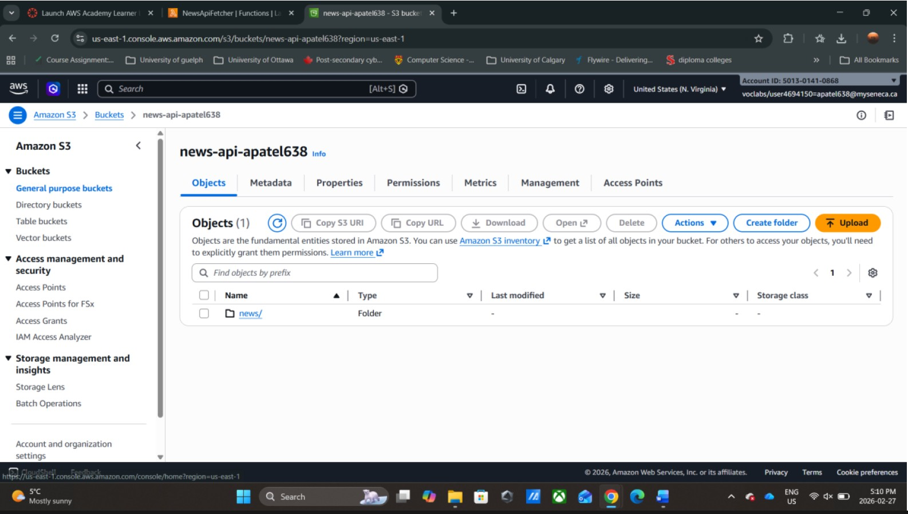
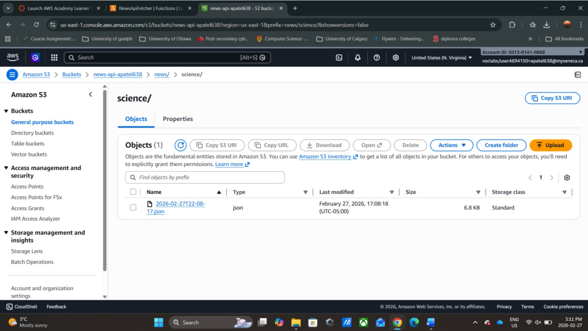
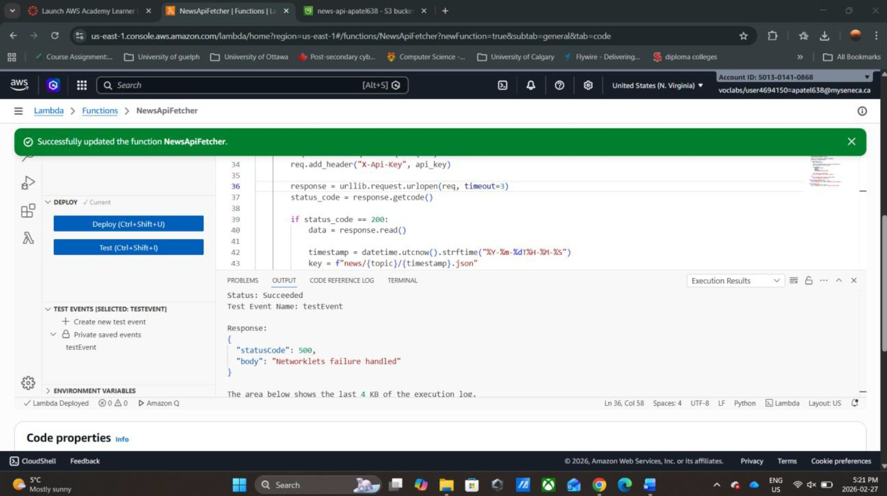
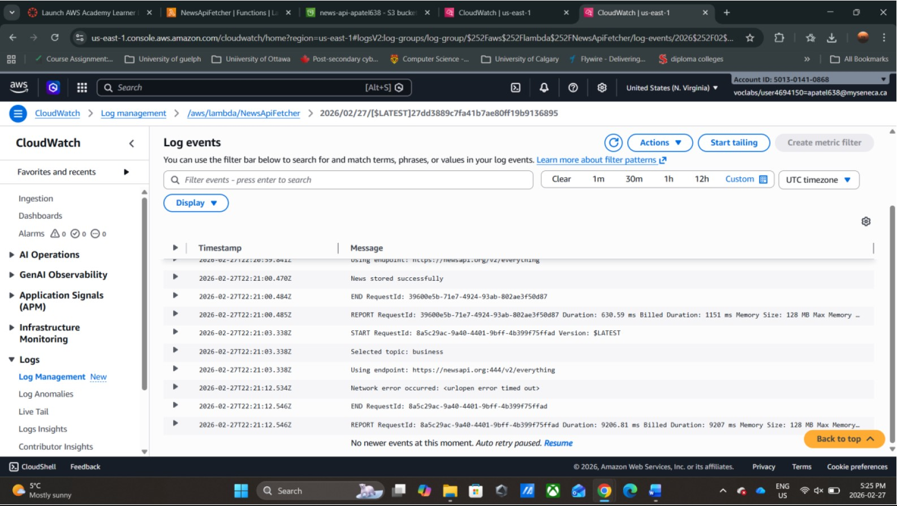
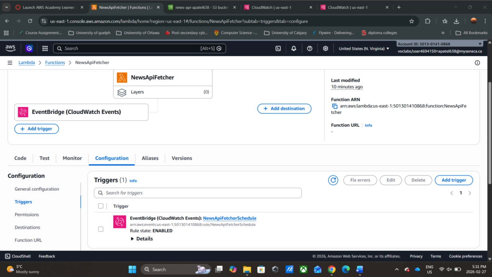
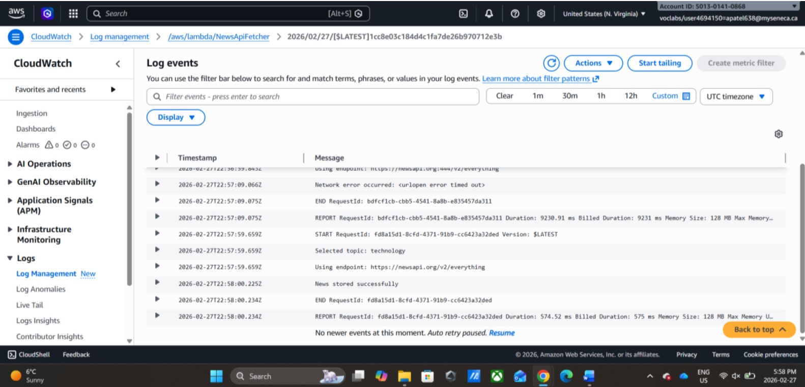

# News API Lambda Function with S3 Storage

An AWS serverless project that automatically fetches news articles from the NewsAPI, stores them in S3 as timestamped JSON files, and runs on an hourly schedule via EventBridge. The function includes intentional failure simulation to validate exception handling and resilience under network errors.

---

## Table of Contents

- [Overview](#overview)
- [Architecture](#architecture)
- [AWS Services Used](#aws-services-used)
- [Environment Variables](#environment-variables)
- [S3 Storage Structure](#s3-storage-structure)
- [Task 1 — S3 Bucket Setup](#task-1--s3-bucket-setup)
- [Task 2 — Lambda Function Creation](#task-2--lambda-function-creation)
- [Task 3 — Environment Variables](#task-3--environment-variables)
- [Task 4 — Lambda Code Implementation](#task-4--lambda-code-implementation)
- [Task 5 — Manual Testing & Validation](#task-5--manual-testing--validation)
- [Task 6 — Failure Simulation & Exception Handling](#task-6--failure-simulation--exception-handling)
- [Task 7 — CloudWatch Log Verification](#task-7--cloudwatch-log-verification)
- [Task 8 — EventBridge Scheduled Trigger](#task-8--eventbridge-scheduled-trigger)
- [Task 9 — Lambda Permissions & Execution Role](#task-9--lambda-permissions--execution-role)
- [Task 10 — Automated Trigger Validation](#task-10--automated-trigger-validation)
- [Challenges & Solutions](#challenges--solutions)
- [Key Learnings](#key-learnings)

---

## Overview

This project implements a fully automated serverless news pipeline on AWS. A Lambda function fetches articles from the NewsAPI based on a randomly selected topic, then persists only successful responses to S3 using a structured key format. The function is hardened with exception handling and intentional fault injection — 1 in 3 executions is routed to an invalid endpoint to test network failure recovery. EventBridge automates execution on a scheduled interval, while CloudWatch provides full observability.

| Component | Detail |
|---|---|
| Cloud Provider | AWS (us-east-1) |
| Runtime | Python 3.10 |
| Trigger | EventBridge — `rate(1 hour)` |
| External API | NewsAPI (`/v2/everything`) |
| Storage | Amazon S3 — JSON per execution |
| Monitoring | Amazon CloudWatch Logs |

---

## Architecture

```
EventBridge (rate: 1 hour)
        │
        ▼
Lambda — NewsApiFetcher (Python 3.10)
        │
        ├── Reads environment variables (API key, topics, count, bucket)
        ├── Randomly selects a topic from NEWS_TOPICS
        ├── Randomly selects endpoint (2/3 valid, 1/3 invalid :444 port)
        │
        ├── [Success] HTTP 200 → stores JSON in S3
        │       └── news/{topic}/{timestamp}.json
        │
        └── [Failure] URLError → logs error, returns HTTP 500
                └── No data written to S3
        │
        ▼
Amazon S3 — news-api-apatel638
└── news/
    ├── technology/
    │   └── 2026-02-27T22-57-59.json
    ├── science/
    │   └── 2026-02-27T22-08-17.json
    └── business/ ...

Amazon CloudWatch
└── Log group: /aws/lambda/NewsApiFetcher
    └── Execution traces, topic selection, endpoint used, success/error output
```

---

## AWS Services Used

| Service | Purpose |
|---|---|
| AWS Lambda | Core function — fetches news and stores to S3 |
| Amazon S3 | Stores successful API responses as JSON |
| Amazon EventBridge | Schedules Lambda execution every hour |
| Amazon CloudWatch | Logs execution traces, errors, and metrics |
| AWS IAM | Execution role (`LabRole`) granting Lambda access to S3 |

---

## Environment Variables

All configuration is stored as Lambda environment variables — no hardcoded values in the code.

| Variable | Example Value | Description |
|---|---|---|
| `NEWS_API_KEY` | `3a19a2f7aed042...` | NewsAPI authentication key |
| `NEWS_COUNT` | `10` | Number of articles to fetch per execution |
| `NEWS_TOPICS` | `technology,science,business,sports,health` | Comma-separated list of topics |
| `S3_BUCKET` | `news-api-apatel638` | Target S3 bucket for storing results |

---

## S3 Storage Structure

Every successful execution creates a timestamped JSON file under a topic-based folder:

```
news-api-apatel638/
└── news/
    └── {topic}/
        └── {YYYY-MM-DDTHH-MM-SS}.json
```

Only HTTP 200 responses are persisted — failed or timed-out requests are logged but never written to S3.

---

## Task 1 — S3 Bucket Setup

An S3 bucket named `news-api-apatel638` is created in `us-east-1` to serve as the storage layer for all news API responses. The bucket is private — access is granted only through the Lambda execution role.



---

## Task 2 — Lambda Function Creation

The Lambda function `NewsApiFetcher` is created using the Python 3.10 runtime in `us-east-1`. The default handler `lambda_function.lambda_handler` is used with x86_64 architecture.



---

## Task 3 — Environment Variables

All sensitive and configurable values are stored as environment variables, keeping the code clean and portable. The API key is encrypted at rest using the default Lambda service key.



---

## Task 4 — Lambda Code Implementation

The function implements the full pipeline: topic selection, endpoint selection with fault injection, API request, response validation, S3 storage, and structured error handling.

```python
import json
import os
import random
import urllib.request
import urllib.error
import boto3
from datetime import datetime

s3 = boto3.client('s3')

def lambda_handler(event, context):
    try:
        # Load environment variables
        api_key = os.environ['NEWS_API_KEY']
        news_count = int(os.environ['NEWS_COUNT'])
        topics = os.environ['NEWS_TOPICS'].split(',')
        bucket_name = os.environ['S3_BUCKET']

        # Select random topic
        topic = random.choice(topics)
        print(f"Selected topic: {topic}")

        # Random endpoint selection (1/3 bad, 2/3 good) — fault injection
        if random.randint(1, 3) == 1:
            endpoint = "https://newsapi.org:444/v2/everything"
        else:
            endpoint = "https://newsapi.org/v2/everything"
        print(f"Using endpoint: {endpoint}")

        url = f"{endpoint}?q={topic}&pageSize={news_count}"
        req = urllib.request.Request(url)
        req.add_header("X-Api-Key", api_key)
        response = urllib.request.urlopen(req, timeout=3)
        status_code = response.getcode()

        if status_code == 200:
            data = response.read()
            timestamp = datetime.utcnow().strftime("%Y-%m-%dT%H-%M-%S")
            key = f"news/{topic}/{timestamp}.json"
            s3.put_object(
                Bucket=bucket_name,
                Key=key,
                Body=data,
                ContentType="application/json"
            )
            print("News stored successfully")
            return {"statusCode": 200, "body": "Success"}
        else:
            print(f"Non-200 status received: {status_code}")
            return {"statusCode": status_code}

    except urllib.error.URLError as e:
        print(f"Network error occurred: {str(e)}")
        return {"statusCode": 500, "body": "Network failure handled"}

    except Exception as e:
        print(f"Unexpected error: {str(e)}")
        return {"statusCode": 500, "body": "Execution failed safely"}
```

**Key design decisions:**
- Uses only `urllib` (Python standard library) — no external dependencies or Lambda layers required
- Fault injection is built into endpoint selection — 1 in 3 requests intentionally target an invalid port (`:444`) to test the `URLError` exception handler
- The 3-second timeout on `urlopen` ensures the function never hangs waiting for the bad endpoint
- Only HTTP 200 responses are written to S3 — error responses are discarded

---

## Task 5 — Manual Testing & Validation

The function is manually invoked via the Lambda console test event. After confirming HTTP 200 and a successful S3 write, the bucket structure is verified — the `news/` directory is automatically created with a topic-based subfolder and a timestamped JSON file inside.







---

## Task 6 — Failure Simulation & Exception Handling

To validate the error handling path, the `urlopen` timeout is reduced to 3 seconds. When the fault injection selects the invalid `:444` endpoint, the connection times out, the `URLError` exception is caught, and the function returns HTTP 500 — without crashing and without writing any data to S3. This confirms the function degrades gracefully under network failure conditions.



---

## Task 7 — CloudWatch Log Verification

CloudWatch log streams confirm full execution visibility — including the selected topic, which endpoint was used, success or error outcome, and runtime metrics such as duration and memory usage. Both successful and failed executions are fully traceable.



---

## Task 8 — EventBridge Scheduled Trigger

An EventBridge rule named `NewsApiFetcherSchedule` is created with the schedule expression `rate(1 hour)`, automating Lambda execution every hour without any manual intervention. The rule state is confirmed as `ENABLED`.



---

## Task 9 — Lambda Permissions & Execution Role

The Lambda function uses the `LabRole` IAM execution role. A resource-based policy statement is added allowing `events.amazonaws.com` (EventBridge) to invoke the function, confirming the scheduled rule has the necessary permissions to trigger execution automatically.

---

## Task 10 — Automated Trigger Validation

The EventBridge rule is temporarily updated to `rate(1 minute)` for testing. CloudWatch logs confirm the function executes automatically on schedule — selecting a topic, hitting the API, and storing the result in S3 with the correct `news/{topic}/{timestamp}.json` key structure verified in the bucket.



---

## Challenges & Solutions

| Challenge | Solution |
|---|---|
| Fault injection caused `Sandbox.Timeout` (15s) instead of a caught exception | Reduced `urlopen` timeout from 10s to 3s so `URLError` is raised before Lambda's runtime limit |
| Initial test returned `"Hello from Lambda!"` instead of news data | Code had been saved but not deployed — clicked **Deploy** in the console before re-testing |
| Invalid endpoint blocked full Lambda timeout on first attempt | Discovered that `urllib` respects the `timeout` parameter — short timeout is essential for fault injection to work correctly |

---

## Key Learnings

- Serverless functions should never block indefinitely — short timeouts on external HTTP calls are essential for predictable failure behaviour
- Fault injection is a legitimate and valuable testing strategy — intentionally routing traffic to a bad endpoint proved the exception handling works before it was needed in production
- Environment variables keep Lambda functions portable and secure — no credentials or resource names should ever be hardcoded
- CloudWatch is not optional — without structured `print()` statements, debugging Lambda execution is nearly impossible
- EventBridge `rate()` expressions are the simplest way to schedule serverless jobs at fixed intervals
